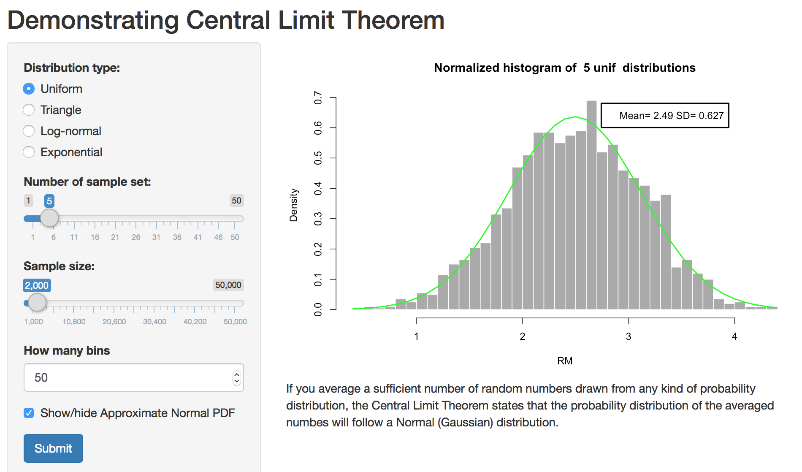

```{r setup, include=FALSE}
knitr::opts_chunk$set(echo = FALSE)
```

## Central Limit Theorem
* This project numrically demonstrates the validity of Central Limit Theorem (CLT)
* CLT states that if random numbers drawn from arbitrary probability distributions are averaged, the mean value is likely to follow a normal (Gaussian) distribution
* To get a good approximation one must average a sufficient number of random numbers

## A demonstration
* Generate 10 sets of uniformaly distributed random number
* Let each set have 1000 numbers
```{r, echo=TRUE}
hist(runif(1000), breaks=20, probability=TRUE, 
     main="Density of generated numbers")
```

## A demonstration - cont
* Take a mean of these sets, resulting a set 1000 mean values
* Do a histogram plot on these 1000 numbers
```{r, echo=TRUE}
hist(10*colMeans(matrix(runif(10000), nrow=10, ncol=1000)), 
     breaks=20, probability=TRUE, main="Density of averaged numbers")
```

## Project Interface


##### Select the type of distribution 
##### How many sets of number (start with 10, higher the better)
##### How many numbers in each set (higher the better)
##### What is the bin size of histogram (moderate size)